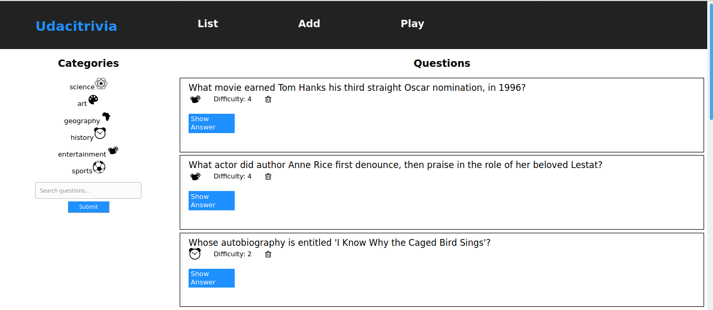

# Full Stack Trivia API

This project is a part of Fullstack Nanodegree with [Udacity](https://www.udacity.com/). It is a trivia full-stack web application. Users can:

- Display questions - both all questions and by category. Questions show the question, category, and difficulty rating by default and can show/hide the answer.
- Delete questions.
- Add questions.
- Search for questions based on a text query string.
- Play the quiz game, randomizing either all questions or within a specific category.

The frontend use [Reactjs](https://reactjs.org/) (View the [README.md](./frontend/README.md) within ./frontend for more details) and the backend use [Flask](https://flask.palletsprojects.com/en/1.1.x/) (View the [README.md](./backend/README.md) within ./backend for more details)

All backend code follows [PEP8 style guidelines](https://www.python.org/dev/peps/pep-0008/).

# Author

    Jaouad Eddadsi

# Acknowledgments

Many thanks to [Udacity](https://www.udacity.com/) for this amazing project
